# Getting Started with Git and GitLab using IntelliJ

This tutorial explains how to create a GitLab repository, clone it locally, make changes and push them back to the GitLab server using IntelliJ.

Table of Content  

* [Step 1 - Install Git](#step-1-install-git)
* [Step 2 - Authenticate with GitLab](#step-2-authenticate-with-gitlab)
* [Step 3 - Create GitLab project](#step-3-create-gitlab-project)
* [Step 4 - Clone GitLab repository locally](#step-4-clone-gitlab-repository-locally-on-your-machine)
* [Step 5 - Create a new project in the local repository](#step-5-create-a-new-project-in-the-local-repository)
* [Step 6 - Add the new project to Git](#step-6-ddd-the-new-project-to-git)
* [Step 7 - Add .gitignore](#step-7-add-gitignore)
* [Step 8 - Make changes and sync them with GitLab](#step-8-make-changes-and-sync-them-with-gitlab)

---

## Step 1: Install Git

Download git from its [download page](https://git-scm.com/downloads) and install it using the default configuration.

---

## Step 2: Authenticate with GitLab

### Create GitLab user

Go to the [GitLab sign in page](https://gitlab.com/users/sign_in) and create a new GitLab account if you don't have one yet. It is recommended to use a GitLab account instead of Google, GitHub etc.


### Log into GitLab

Go to the [GitLab sign in page](https://gitlab.com/users/sign_in) and use your credentials.

GitLab will redirect you to the home page of your account and prompt you to create a project.


---

## Step 3: Create GitLab project

Click the `Create a project` button.


Give your project a name, slug, set its `Visibility` to `Private`, optionally choose generating a README file and click `Create project`.

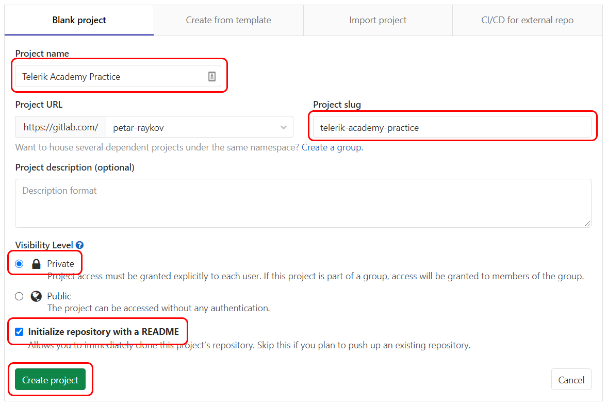

GitLab will create an empty repository.


---

## Step 4: Clone GitLab repository locally (on your machine)

To start using the repository on your machine you have to clone it.

Start by obtaining the clone address for the repository.


In the copy/paste clipboard you should have an address similar to the one below.

```
https://gitlab.com/petar-raykov/telerik-academy-practice.git
```

**Save it somewhere because we will need later.**

Launch IntelliJ and select `Get from Version Control`.

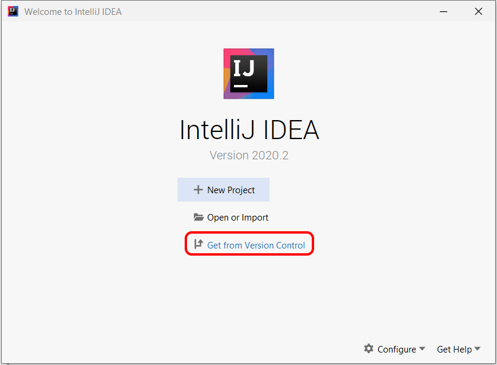

Paste the GitLab clone address into `URL` and choose a local folder where the repository will be cloned.

> The local folder **MUST** be empty!

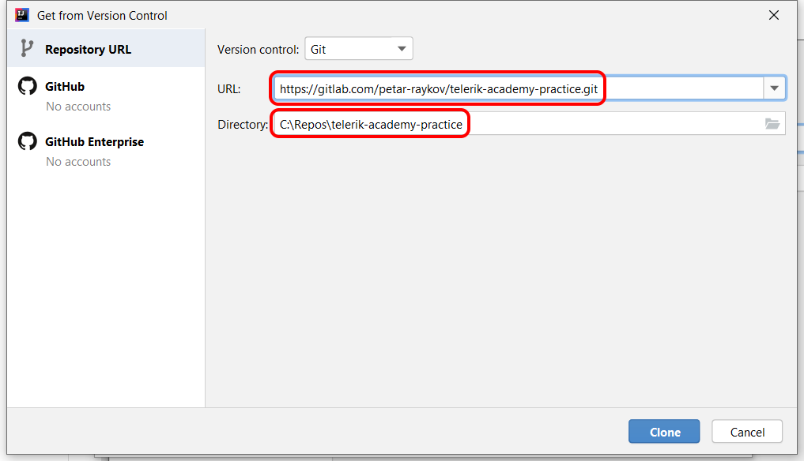

Click the `Clone` button.

You will be prompted to enter your credentials which will be stored in the Windows Credentials Manager so that you don't have to enter them every time.

If you have authenticated correctly, IntelliJ will clone the repo, create an empty project and open it.

Right-click the project and click `Show in Explorer` to navigate to the repo directory.

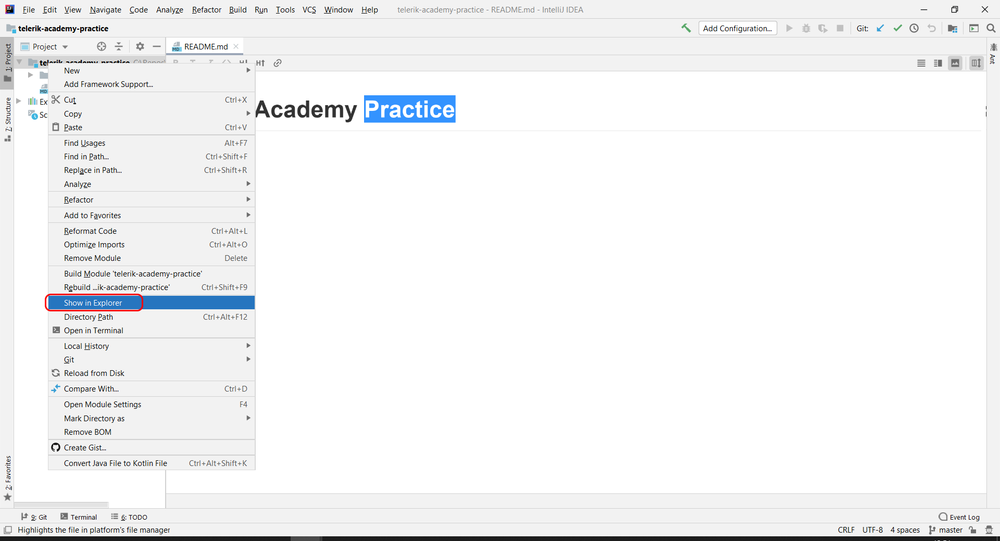

Since this empty project is useless you can close IntelliJ and delete the project (.idea folder) from the repo's directory.

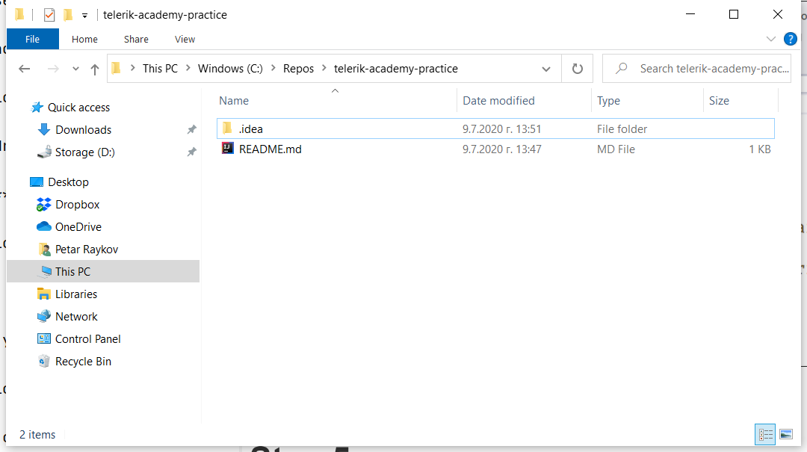

---

## Step 5: Create a new project in the local repository

Now let's create a new project in the local repository.

Open IntelliJ and select `Create New Project`.


Follow the steps in the wizard and fill project name and location.

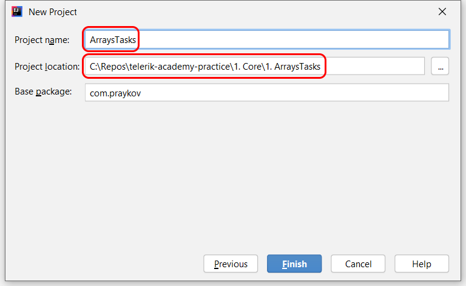

>You can create a new directory structure according to your preferences


Click `Finish` and the new project will be created and loaded in IntelliJ IDEA.

Now the project is just created in the repository directory but not added to Git so let's add it.

---

## Step 6: Add the new project to Git

Open the `Git` tool window located at the bottom left.

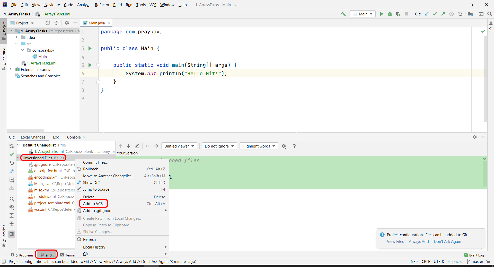

In the `Local Changes` tab you will see the list with all files created that git has detected. Right-click the root and select `Add to VCS`.


All files will become green which means that they are staged and ready for commit.

>You can view them in hierarchy using the options on the left.

Right-click the root of the files and click `Commit file`. A new dialog will be displayed.

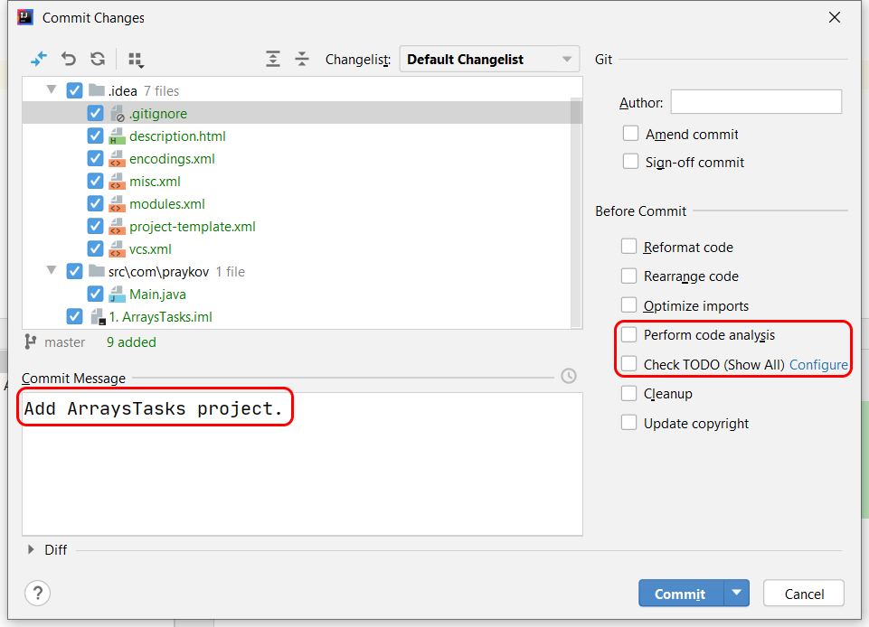

Fill `Commit Message` and deselect `Perform code analysis` and `Check TODO...` options and click `Commit`.

By committing the files you tell git to store their current state as a new version.

Now these changes are only available in your local repository and not synced with the repo in GitLab so let's push them to GitLab.

Open the `Git` tool window again and switch to the `Log` tab.

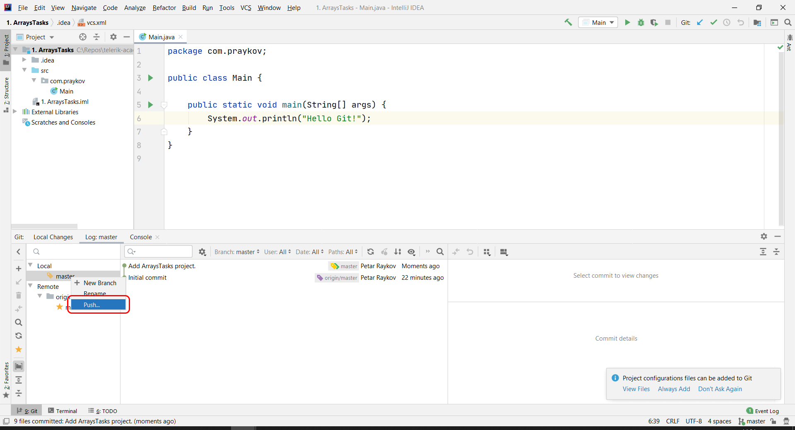

Now you can right-click `master` and select `Push` which will load a new dialog.


You will see all commits that you want to push to the central repo and by clicking `Push` you will sync with it.

Now you can refresh the GitLab page in your browser and see the new project there.


---

## Step 7: Add .gitignore

Usually, there are some files that we don't want to add to the git repository (we don't want to store versions for them). The most common scenarios are some user specific files (files that are different for each user/machine and don't concern the source code) and output files (.class) that are generated during compilation. To instruct Git not to monitor them we can use `.gitignore` file. Let's add one to our repository.

Open the repo's directory, create a new text file and rename it to `.gitignore`.

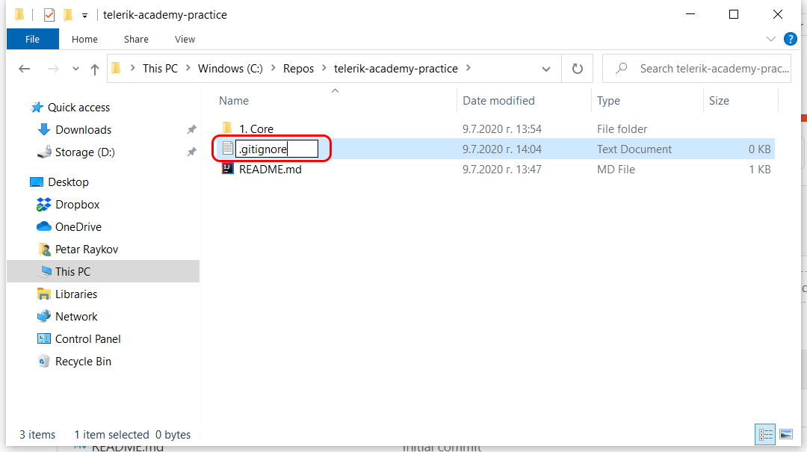

>Note that you can add `.gitignore` in each directory thus have different list of ignored files. At this point this won't be needed.

Now open the `.gitignore` file and update its content. The idea is to list all files (or group of files) that we want to ignore.

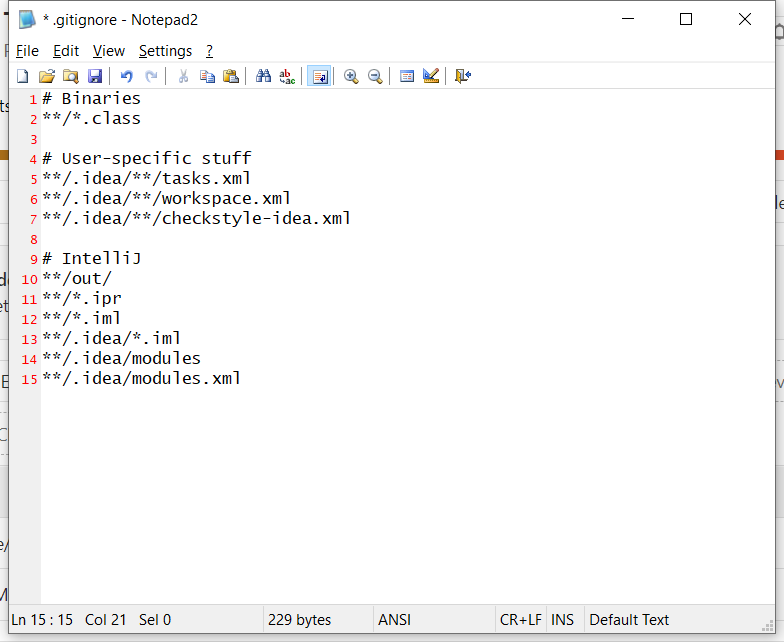

```
# Binaries
**/*.class
**/out/

# User-specific stuff
**/.idea/**/workspace.xml
**/.idea/**/tasks.xml
**/.idea/**/checkstyle-idea.xml
**/*.iml
**/*.ipr
**/.idea/**/*.iml
**/.idea/**/modules
**/.idea/**/modules.xml
```

Next step is to commit the new file using the `Git` tool window and the commit dialog

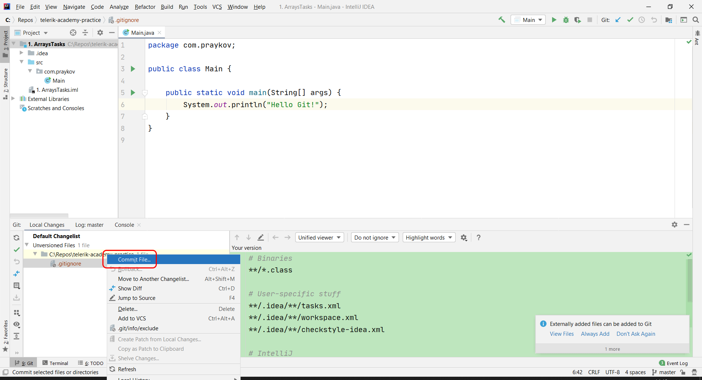

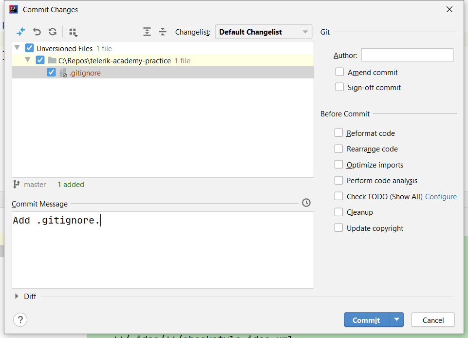

---

## Step 8: Make changes and sync them with GitLab

Return to IntelliJ and open the main file. Update it with the following code:

```java
package com.praykov;

public class Main {

    public static void main(String[] args) {
        System.out.println("Hello Git!");

        System.out.println("Now I can continue make changes to my project :)");
    }
}
```

Open the `Git` tool window where you can inspect your local changes. You see all files that have been modified and preview of the modification (the code in green is a new code).

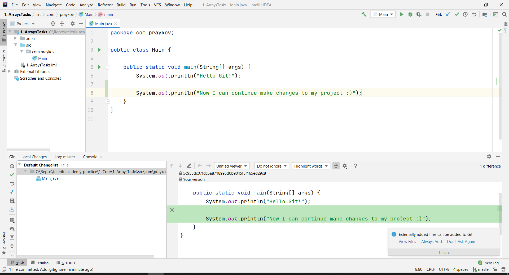

We can commit the changes, switch to the `Log` tab and `Push` the new commits to GitLab.

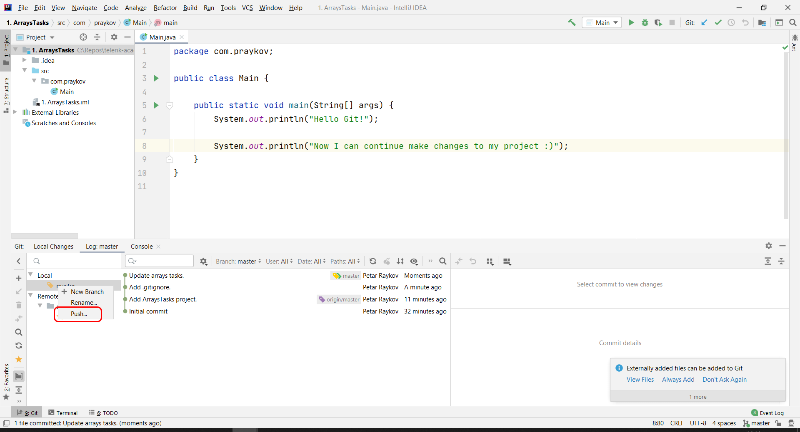

On the right side you can see all commits and which is the last one synchronized with GitLab.


On the `Push` dialog you can once again review the commits and the changes that you are going to sync with GitLab.

Let's go to GitLab again and naviate to the `Commits` page where we can see that all local changes are now available in the central repo as well.

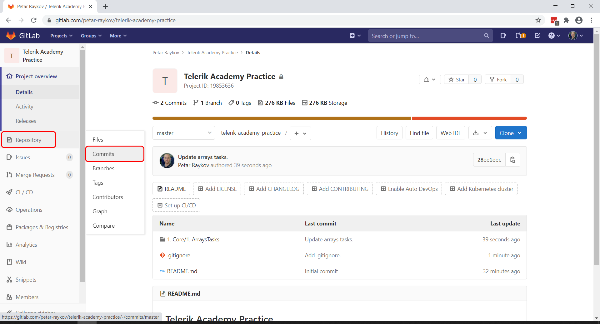


---
